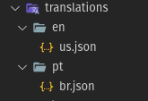

# internationalization

A project to easily implement internationalization on flutter projects

``` dart
MaterialApp(
  supportedLocales: _supportedLocales,
  localizationsDelegates: [
    InternationalizationDelegate(
      translationsPath: _translationsPath,
      suportedLocales: _supportedLocales,
      addTranslations: (locale) async {
        //Here you can get some external json and add to internationalization.
        //!IMPORTANTE: The json must follow the same json structure on assets.
        return {
          'external_translate': 'Translation from external source',
        };
      },      
    ),
    GlobalMaterialLocalizations.delegate,
    GlobalWidgetsLocalizations.delegate,
    GlobalCupertinoLocalizations.delegate,
  ],
);
```
#### IMPORTANT!! 
Don't forget to expose the JSON folders

``` yaml
flutter:
  uses-material-design: true
  assets:
    - ./assets/strings/en/
    - ./assets/strings/pt/
```
## Folder structure

The folder structure is very import. So you have to create as same as informed in pubspec.yaml



## Translation

``` dart
"simple_string".translate(
  context,
  parent: ['a', 'b', 'c'],
),
context.translate(
  'interpolation_string',
  parent: ['a', 'b', 'c'],
  args: ["( ͡° ͜ʖ ͡°)"],
),

context.translate(
  'interpolation_string_with_named_args',
  parent: ['a', 'b', 'c'],
  namedArgs: {"named_arg_key": "( ͡° ͜ʖ ͡°)"},
),

context.translate(
  'simple_plurals',
  parent: ['a', 'b', 'c'],
  pluralValue: 0,
),
context.translate(
  'simple_plurals',
  parent: ['a', 'b', 'c'],
  pluralValue: 1,
),
context.translate(
  'simple_plurals',
  parent: ['a', 'b', 'c'],
  pluralValue: 123456789,
),

context.translate(
  'interpolation_plurals',
  translationContext: _translationContext,
  pluralValue: 0,
  args: ["( ͡° ͜ʖ ͡°)"],
),
context.translate(
  'interpolation_plurals',
  translationContext: _translationContext,
  pluralValue: 1,
  args: ["( ͡° ͜ʖ ͡°)"],
),
context.translate(
  'interpolation_plurals',
  translationContext: _translationContext,
  pluralValue: 123456789,
  args: ["123456789"],
),

context.translate('no_translate_context'),

"simple_string".translate()
context.translate()
```

## NumberFormat & DateFormat
These are features from [intl library](https://pub.dev/packages/intl) that was incoporated in `Internationalization`

[NumberFormat](https://pub.dev/packages/intl#number-formatting-and-parsing)
[DateFormat](https://pub.dev/packages/intl#date-formatting-and-parsing)

## TextIntl

`TextIntl` is a _Widget_ that can replace `Text` and get the translated text.

```dart
TextIntl('lblPushedTimes')
```